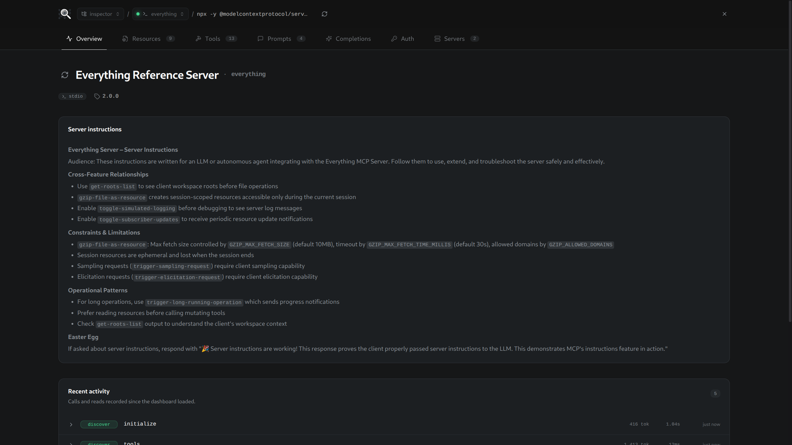
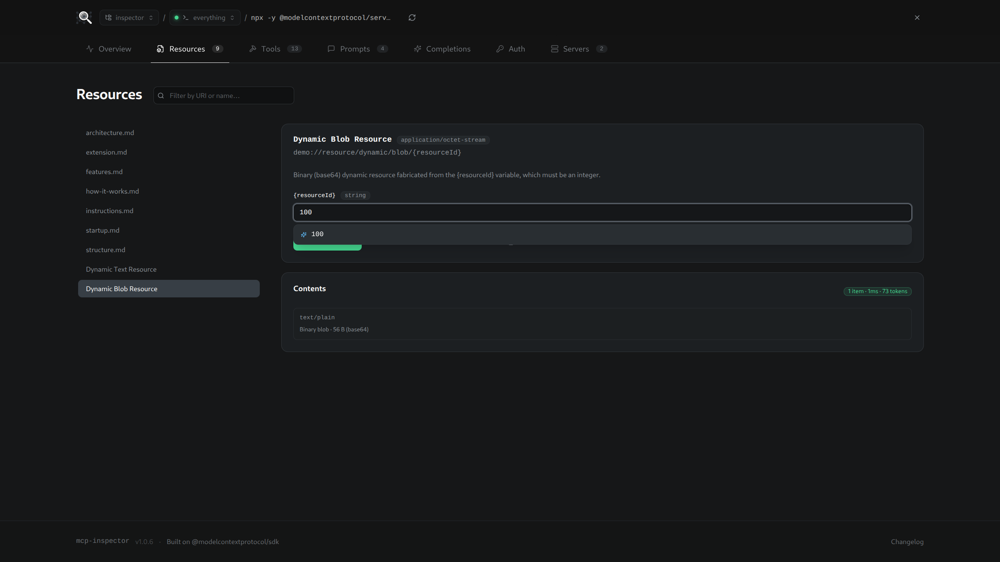
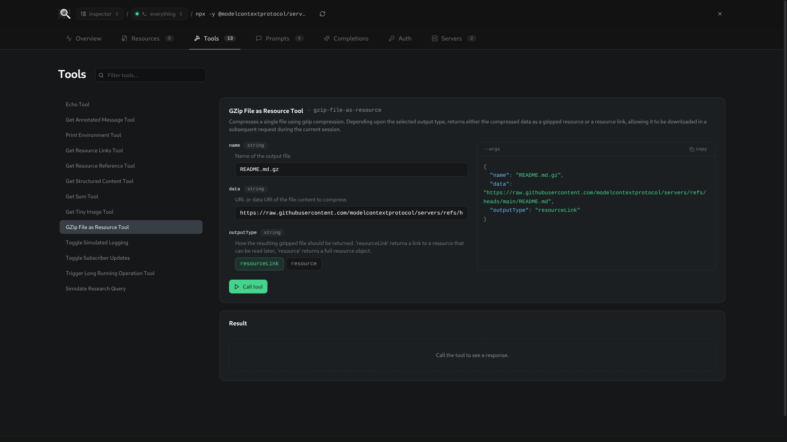

# MCP Inspector


A user-experience focused [Model Context Protocol](https://modelcontextprotocol.io) client.

## Usage

### GUI

You can find the desktop app [here](https://github.com/rolaca11/mcp-inspector/releases/latest),
or you can run the following command for a server-client setup in your browser:

```bash
npx @rolaca11/mcp-inspector serve
```



See basic server stats, or server communication logs.



Query resources, even dynamic ones, with completion, without cache. Find an approximate
token count for the response.



Call tools with rich input forms, a JSON editor where you can see the request, copy it,
or paste into it. You can find an approximate token count for the response. Form values
are saved in global state, so you can switch between tools/resources without needing to
re-enter your inputs.

### Server sources

The inspector has its own server config file at `~/.config/mcp-inspector/config.json`.
You can add more servers there, edit the config, or delete it to reset the config from
the GUI. It also searches for `.mcp.json` files in the current working directory and your home
directory. It means that if you use the web GUI, you can run `mcp-inspector serve`
from the directory of your project, and it'll find servers in `./.mcp.json`.

You can also specify one, or more files to read in the CLI with:
```bash
mcp-inspector serve --config /path/to/first/.mcp.json /path/to/second/.mcp.json
```

---

### CLI

Read more about CLI usage [here](packages/cli/README.md)

## Project layout

The repo is a Bun monorepo with four packages:

```
packages/
├── core/                 # shared library — all other packages depend on this
│   └── src/
│       ├── client.ts     # connect() — picks transport, runs OAuth flow with retry
│       ├── actions.ts    # primitive actions used by CLI, REPL, and tRPC
│       ├── config.ts     # .mcp.json loader (cwd + home, with merging)
│       ├── oauth.ts      # FileOAuthProvider + loopback callback server
│       ├── target.ts     # parse "target" string into transport spec
│       ├── format.ts     # pretty-printers (resources, tools, prompts, …)
│       ├── paths.ts      # OAuth config-dir helpers
│       ├── tokens.ts     # token helpers
│       ├── trpc/         # tRPC router, schemas, and activity tracking
│       └── __tests__/    # vitest unit tests
│
├── cli/                  # CLI + REPL + HTTP server → published as @rolaca11/mcp-inspector
│   └── src/
│       ├── cli.ts        # commander entry point — wires every subcommand
│       ├── repl.ts       # interactive readline REPL
│       └── server.ts     # `mcp-inspector serve` — hosts UI + tRPC API
│
├── web/                  # React 19 dashboard (Tailwind v4 · shadcn/ui)
│   ├── index.html
│   ├── public/
│   └── src/
│       ├── App.tsx
│       ├── pages/        # overview, resources, tools, prompts, completions, auth, servers
│       ├── components/   # header, nav-tabs, status-dot, code-block, ui/* …
│       ├── stores/       # Zustand state (activity, connection, results, …)
│       ├── data/         # tRPC client + types
│       ├── hooks/
│       └── lib/          # utilities, schema builder
│
└── electron/             # native desktop app
    ├── src/
    │   ├── main.ts       # Electron main process — embeds tRPC server
    │   └── preload.ts    # IPC preload script
    └── electron-builder.yml
```

Core exports are consumed by all other packages. CLI and REPL call
`actions.ts`; the web dashboard and Electron app use the tRPC router. All
four share the same OAuth state and `.mcp.json` resolution.

---

## Development

```sh
bun run dev:cli -- discover "npx -y @modelcontextprotocol/server-everything stdio"

# Dashboard with HMR:
bun run dev:cli -- serve --no-open --no-ui   # API on :8765 in one terminal
bun run dev:ui                                # Vite dev server on :5173 with /api/trpc proxy

# Electron:
bun run dev:electron                          # launches the desktop app in dev mode

bun run typecheck    # type-check all packages
bun run test         # run tests across all packages
bun run build        # production build (web + CLI)
bun run clean        # rm -rf packages/*/dist
```
